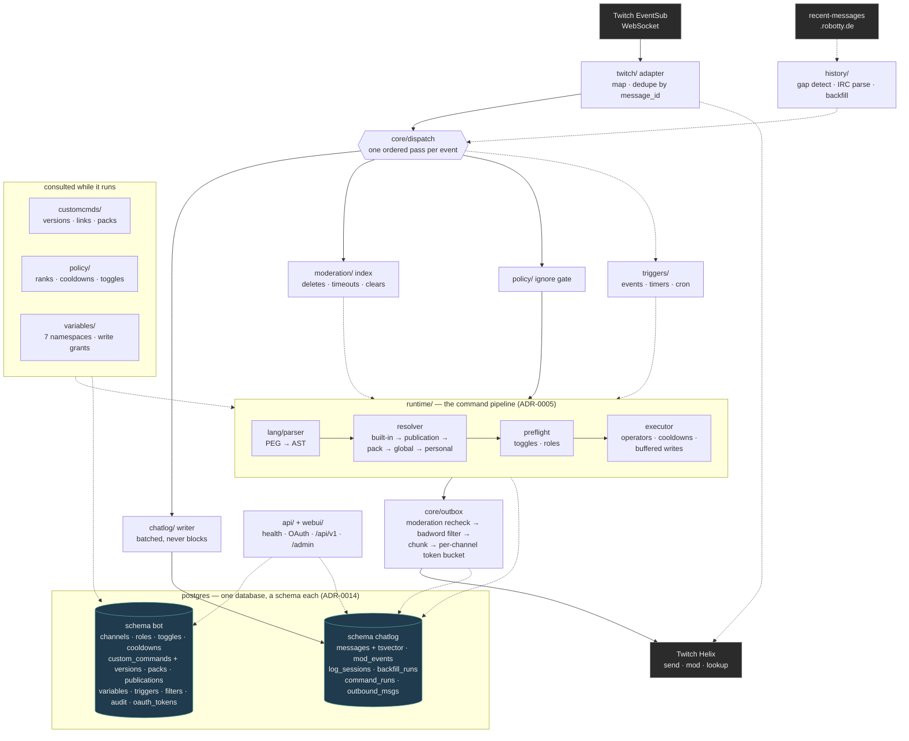
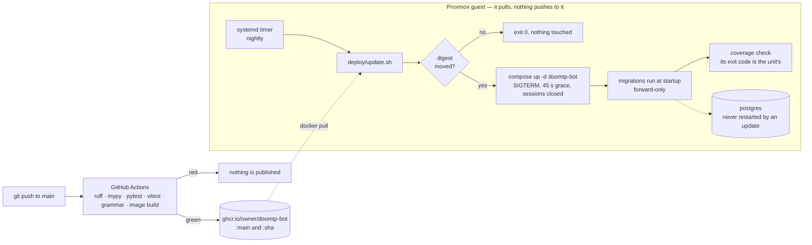

# doomtp-bot — Architecture

**Status:** Accepted, built · **Date:** 2026-09-16 · **Revision:** 5 (2026-09-23: checked against
`src/` section by section; what was promised and not built is tracked as `ARCH-1`…`ARCH-9` on the
[roadmap](roadmap.md) until it is either built or taken out of this document)

*Revision 4 (2026-09-21): diagrams redrawn from the built system; deployment section follows ADR-0013.*

A multi-channel Twitch chat bot written in Python, self-hosted on a homelab in a container. The main features are a composable command language, user-published custom commands, a complete chat log, and a REST API with a web UI.

| Doc | Topic |
|-----|-------|
| [command-language-spec.md](command-language-spec.md) | **Formal command language spec v1.0** (lexing, grammar, AST, preflight, evaluation, placeholders, sentinels, conformance tests) |
| [command-language-proposal.md](command-language-proposal.md) | Superseded syntax proposal. Kept for rationale and the deferred and test items. |
| [namespaces.md](namespaces.md) | **Canonical registry** of placeholder namespaces, argument types and reserved names |
| [variable-access-matrix.md](variable-access-matrix.md) | Read/write access per namespace and actor, grant types, admin actions (reviewed) |
| [ADR-0001](adr/0001-chat-transport-eventsub-websocket.md) | Read chat through EventSub over WebSocket and send through the Helix API |
| [ADR-0002](adr/0002-twitch-library-twitchio.md) | Use TwitchIO 3.x behind an adapter |
| [ADR-0003](adr/0003-storage-sqlite.md) | *(superseded by ADR-0014)* SQLite with two files: `bot.db` (state) and `chatlog.db` (logs) |
| [ADR-0004](adr/0004-modular-monolith.md) | One async process, one container |
| [ADR-0005](adr/0005-command-pipeline-runtime.md) | Command runtime: an AST, preflight checks, and a three-part `Result` |
| [ADR-0006](adr/0006-permissions-cooldowns-toggles.md) | Ranked roles, per-tier and per-user cooldowns, layered toggles |
| [ADR-0007](adr/0007-channel-access-tiers.md) | Join channels in basic, moderator and full tiers, with capability detection |
| [ADR-0008](adr/0008-history-backfill-recent-messages.md) | Fill chat log gaps from recent-messages.robotty.de |
| [ADR-0009](adr/0009-user-custom-commands-sharing.md) | User-owned custom commands: link, publish, edit, versions |
| [ADR-0010](adr/0010-variables-scopes.md) | Variables: seven namespaces, exact-name write grants, all public for now |
| [ADR-0011](adr/0011-parser-and-web-editor.md) | One authoritative server-side PEG parser. The web editor highlights locally and gets diagnostics from the API. |
| [ADR-0012](adr/0012-derived-commands-and-packs.md) | Derived commands are global publications; packs publish a set at once |
| [ADR-0013](adr/0013-deploy-by-pulling-a-published-image.md) | CI publishes the image; the server pulls it on a timer |
| [ADR-0014](adr/0014-storage-postgres-one-database-two-schemas.md) | **Postgres**: one database, a `bot` schema and a `chatlog` schema (supersedes ADR-0003) |
| [ADR-0015](adr/0015-metrics-prometheus-text-on-the-api.md) | Metrics: counters in Prometheus text on `/metrics`, no new dependency |

---

## 1. Requirements

### Functional

| # | Requirement |
|---|-------------|
| F1 | **Log every chat message** into a queryable database. **Never delete log rows.** Deletions, timeouts, bans and clears are recorded as events and flagged on the affected messages. |
| F2 | **Fill log gaps** caused by crashes, updates or disconnects from a third-party history service (recent-messages) |
| F3 | **Command language** with pipes and chain operators (`\|`, `&&`, `\|\|`, grouping, `>`/`>>` variable writes) and sentinel commands (`true`, `false`, `default`, `fail`). A pipe stops on failure, and `\|\|` handles failures. Details are in the language proposal. |
| F4 | **Commands return three things:** an exit code (0 = success), a formatted message (shown when it's the final result) and structured data (usable by later commands, e.g. `{1.celsius}`) |
| F5 | **Permission tiers:** Twitch built-ins (broadcaster, lead mod, mod, VIP, sub), custom roles (e.g. ambassador) at any rank including above moderator, and **global bot owners and bot admins** above everything |
| F6 | **Cooldowns:** a global cooldown per tier **and** a per-user cooldown. **Both must have expired** for the command to run. Rejections are silent, with an optional **callback** that can customize the response. |
| F7 | **Toggles** for modules and individual commands, **globally and per channel** |
| F8 | **Per-channel command prefix**, defaulting to `🏜`. An emoji prefix may be followed by a space (`🏜 ping`); an ASCII one may not (spec §2.1). |
| F9 | **Command self-documentation:** every command defines a description, parameters, data outputs and usage examples. Chat `!help` lists only the commands *that user* can run. The REST API lists **all** commands for a docs web page. |
| F10 | **`!explain <expr>`:** dry run that shows the parse tree, name resolution, and the result of every policy check |
| F11 | **Custom commands:** users build pipelines, save them under their own alias, **publish** them to channels where they have permission, **link** other users' commands under their own alias, and **republish** them. **Edits propagate instantly.** Linking and publishing replies warn about this. Parameters are documented as `arg.N`. |
| F12 | **Variables:** `{chatter.x}` (global per user), `{channel.x}`, `{channel.chatter.x}`, `{publisher.x}`, `{publisher.chatter.x}`, `{publisher.channel.x}`, `{publisher.channel.chatter.x}`. Namespaces are kept in a canonical registry, and access rules and grants in a review matrix. |
| F13 | **Triggers:** channel point redemptions, raids, subs, other events, **timers**, and regex **listeners** can each run a pipeline |
| F14 | **Moderation-aware replies:** the bot doesn't reply if the triggering message was deleted, or its author was timed out or banned, while the command was processing |
| F15 | **Badword filter:** global and per-channel lists. A matched word can be censored (`****`), replaced (`flowers`), tagged (`[slur]`) or cause the message to be blocked. |
| F16 | **Ignore list** for other bots and specific users, global and per channel |
| F17 | **Logs:** an audit log of every configuration change, and a command usage log with a **log level set per command** |
| F18 | **Channel onboarding:** a full tier where the broadcaster authorizes the bot, and a **basic tier that needs no broadcaster action** |
| F19 | **REST API** (health checks now, `/api/v1` later) plus a **web admin UI** and a **public web UI** |

### Out of scope (for now)

- A personal Twitch dashboard for each user with Twitch login on the website. It's a future feature: the API and auth layers shouldn't block it, and it isn't designed here.

### Non-functional

| Concern | Target |
|---------|--------|
| Scale | 1–20 channels. About 50 messages/s peak, with a much lower average. |
| Latency | Replies go out within 1 s, not counting rate-limit waits or the optional moderation hold. Logging never blocks commands. |
| Log durability | Every message received is stored, except messages still in the batch window (≤1 s) at the moment of a crash. Gaps are recorded explicitly and filled from recent-messages where possible. |
| Safety | All chat input is untrusted. Pipelines have bounded time, size and depth. Published commands run with the **invoker's** permissions. |
| Footprint | Under 250 MB RAM |
| Network | Outbound-only connections to Twitch. The API and web UI are LAN-only until a reverse proxy and authentication are added. |

---

## 2. High-level design

One process, one container for the bot, plus the database's (ADR-0004, ADR-0014). Everything below runs
on a single event loop. Solid arrows are the path a chat message takes, dotted ones are everything else.



Three properties the picture is meant to make obvious:

- **Nothing reaches in.** The four outside boxes are all connections *the bot opens* — events arrive
  down a socket it dialled, and even the deploy is a pull (ADR-0001, ADR-0013). The homelab needs no
  port forward, and the web UI is bound to localhost.
- **Logging is not in the command path.** The writer is a queue; a slow disk delays storage, never a
  reply, and every message is logged including ignored users' (architecture §3.1).
- **The pipeline is the only thing that runs user text**, and it is checked at both ends: preflight
  before anything runs, and the outbox again immediately before the send.

### Main flow: a chat command

1. The adapter receives `channel.chat.message`, maps it to a `ChatMessage` and dedupes it.
2. The Dispatcher handles it in order:
   - **ChatLogger** queues it for storage. This always happens, including for ignored users.
   - The **Ignore gate** stops processing here if the sender is ignored, is the bot itself, or carries the Twitch chat-bot badge (configurable).
   - **Dispatch** checks whether the message starts with the channel prefix, which makes it a command expression, and runs any regex **listeners** enabled for the channel.
3. The runtime handles the expression (ADR-0005):
   1. **Parse** the text into an AST.
   2. **Resolve** each command name. The order is built-in, then published in the channel, then the user's personal commands.
   3. **Preflight** every command against toggles and roles. On a denial, the runtime runs the optional callback and otherwise stays silent.
   4. **Execute** the commands, applying operator semantics. Each command's cooldowns are checked when execution reaches it, so one on cooldown fails with 128 and `||` can route around it. Variable writes are buffered.
4. **Moderation checkpoints:**
   - The runtime checks the Moderation Index between stages and cancels if the trigger was invalidated (exit code 130).
   - The **Outbox rechecks immediately before calling Helix**.
   - Buffered variable writes are committed only if the run wasn't cancelled.
5. The final result goes through the Outbox: badword filter, then chunking, then the rate limit, then send. What was actually sent is written to `outbound_msgs`.
6. The run is recorded in `command_runs` according to the command's log level.

### How step 1 is tested

The adapter is the one place a change on Twitch's side arrives silently, so it is pinned from both ends
with Twitch's own event simulator (the [Twitch CLI](https://dev.twitch.tv/docs/cli/)):

- `tests/chat/test_eventsub_mock_server.py` runs the bot's client and handlers against the mock EventSub
  server — the welcome, the session id, an event off the wire into the dispatcher's sink, and a
  `session_reconnect` that moves the session without dropping what comes next (ADR-0001).
- `tests/fixtures/eventsub/*.json` are notifications recorded from that simulator by
  `scripts/record_eventsub.py`, replayed through TwitchIO's parser into the adapter by
  `tests/chat/test_eventsub_contract.py` (ADR-0002). The simulator has no `channel.chat.*` topic, so chat
  messages, notices and deletions are still covered with hand-built payload objects.

Both skip themselves where the CLI isn't installed; CI installs it.

---

## 3. Chat log, moderation events, gaps

### 3.1 Log everything, delete nothing

- Messages are **never** deleted or altered in response to moderation. Moderation *adds* rows to `mod_events` and sets flags on the affected messages.
- **Retention defaults to forever.** An admin-only, audited purge tool can be added later if a legal or privacy need comes up. It is not automatic.

| EventSub event (basic tier) | Stored as |
|-----------------------------|-----------|
| `channel.chat.message` | `messages` row |
| `channel.chat.notification` (subs, resubs, gifts, raids, announcements…) | `chat_notifications` row, and also published to Triggers |
| `channel.chat.message_delete` | `mod_events(type='delete', message_id)`; sets `messages.deleted_at` |
| `channel.chat.clear_user_messages` (a timeout or ban happened) | `mod_events(type='user_clear', target_user_id)`; sets `messages.cleared_at` on that user's recent messages |
| `channel.chat.clear` | `mod_events(type='chat_clear')`; sets `messages.cleared_at` for the channel |
| `channel.moderate` / `channel.ban` (mod or full tier only) | Enriches `mod_events` with the moderator, reason, duration and action type |

Deletions are flags, never row removals. Queries and the web UI choose whether to hide flagged messages. The raw text is kept.

### 3.2 Schema (schema `chatlog`)

Sketch only — `storage/migrations/chatlog/0001_init.sql` is the truth. Timestamps are `bigint`
milliseconds since the epoch throughout.

```sql
messages(
  message_id text PRIMARY KEY, channel_id text NOT NULL,
  user_id text NOT NULL, user_login text NOT NULL, display_name text,
  text text NOT NULL, message_type text, badges text, fragments text,   -- badges/fragments are JSON
  bits bigint DEFAULT 0, reply_parent_id text, reward_id text, source_channel_id text,
  is_self boolean DEFAULT false, is_command boolean DEFAULT false,
  source text NOT NULL DEFAULT 'eventsub',     -- eventsub | recent-messages
  raw text,                                    -- original IRC line when backfilled
  sent_at bigint NOT NULL, received_at bigint NOT NULL,
  deleted_at bigint, cleared_at bigint, mod_event_id bigint,
  tsv tsvector GENERATED ALWAYS AS (to_tsvector('simple', chatlog_unaccent(text))) STORED)
-- indexes: (channel_id, sent_at), (user_id, sent_at), GIN on tsv

chat_notifications(id text PRIMARY KEY, channel_id text, user_id text, type text,
                   payload text, source text, sent_at bigint)
mod_events(id bigint IDENTITY PRIMARY KEY, channel_id text, type text, message_id text,
           target_user_id text, moderator_user_id text, duration_s integer, reason text,
           source text, at bigint)
users(user_id text PRIMARY KEY, login text, display_name text, first_seen bigint, last_seen bigint)
user_names(user_id text, login text, display_name text, seen_from bigint, PRIMARY KEY (user_id, login))

log_sessions(id bigint IDENTITY PRIMARY KEY, channel_id text, started_at bigint, ended_at bigint,
             end_reason text)                        -- live coverage intervals
backfill_runs(id bigint IDENTITY PRIMARY KEY, channel_id text, gap_from bigint, gap_to bigint,
              fetched integer, inserted integer, complete boolean, error text, at bigint)

command_runs(id bigint IDENTITY PRIMARY KEY, channel_id text, user_id text, trigger_type text,
             trigger_id text, expr text, resolved text, code integer, message text,
             duration_ms bigint, cancelled_reason text, run_ref text, at bigint)
outbound_msgs(id bigint IDENTITY PRIMARY KEY, channel_id text, run_ref text, text_sent text,
              text_prefilter text, filter_hits text, twitch_message_id text,
              dropped_reason text, at bigint)
-- run_ref is the runtime's run id: it links every sent or dropped message to the run that produced it
```

**Search** is the `tsv` generated column with a GIN index, queried with
`websearch_to_tsquery('simple', chatlog_unaccent(%s))` — so `cafe` and `café` find each other, and
`"exact phrase"` and `-excluded` work the way a search box is expected to. The `simple` configuration is
deliberate: chat is multilingual and English stemming would mangle it. `chatlog_unaccent()` is an
`IMMUTABLE` wrapper around `unaccent` with the dictionary pinned by name, because a generated column may
only call immutable functions.

All users are keyed by **`user_id`**. Logins are snapshots plus rename history.

### 3.3 Gaps and backfill (ADR-0008)

- `log_sessions` records exactly when the bot was listening to each channel.
- On startup — including the one after a stopped Twitch client is started again (ADR-0001) — the **HistoryProvider** fetches `recent-messages/:channel?after=<gap_from - 5s>` for every gap longer than 5 s. A reconnect TwitchIO handles inside one running client never ends the session, so there is no gap to fill for it.
- It parses the raw IRC lines and inserts them with `source='recent-messages'`. Inserts are idempotent on the message ID.
- It records a `backfill_runs` row. The row is marked `complete=0` if the service hit its 800-message cap or reported `channel_not_joined`.
- **Backfilled events never trigger commands, listeners or triggers.**
- The service only starts collecting a channel after the first request for it, so the bot **keeps each channel warm** with periodic `limit=1` requests.
- Per the service's guidelines, backfill is **opt-in per channel**, chosen at onboarding: `!join` says the log has started and points at `!backfill`, which names the service and what it would receive before anything is sent there, and only the broadcaster can turn it on.

---

## 4. Command runtime (ADR-0005; syntax in the language proposal)

### 4.1 Result model

```python
@dataclass(frozen=True)
class Result:
    code: int = 0                 # 0 ok; non-zero = error (see table)
    message: str | None = None    # human text; sent to chat only if this is the final result
    data: JsonValue = None        # structured; addressable as {N.path} / {_.path}
```

| Code | Meaning (shell-inspired) |
|------|--------------------------|
| 0 | Success |
| 1 | Generic failure. The command decides the message. |
| 2 | Usage error (bad parameters) |
| 3 | Not found or empty result |
| 124 | Timeout |
| 125 | Rate-limited by an upstream API |
| 126 | Permission denied (surfaced in `!explain` and callbacks, never in chat by default) |
| 127 | Unknown or disabled command (silent) |
| 128 | Cooldown (silent, unless a callback is set) |
| 130 | Cancelled by moderation |

### 4.2 Command specification (self-documenting)

```python
@command(
    name="weather", module="weather", aliases=["w"],
    summary="Current weather for a location",
    description="Looks up current conditions. Defaults to your saved {chatter.location}.",
    params=[                                   # positional, documented as arg.N
        Param("1+", name="location", type="str", required=False,
              description="City name; falls back to {chatter.location}"),
    ],
    input=InputMode.OPTIONAL,                # can receive piped data
    data_schema={"celsius": float, "fahrenheit": float, "condition": str, "location": str},
    examples=[                                 # {sign} = the reader's own command sign
        Example("{sign}weather Lisbon", "Lisbon: 21°C, clear"),
        Example('{sign}weather Lisbon | echo "it\'s {1.celsius}C now!"', "it's 21C now!"),
    ],
    required_role="everyone",
    default_cooldowns={"everyone": Cooldown(tier_s=10, user_s=30), "moderator": Cooldown(0, 0)},
    log_level=LogLevel.INVOCATIONS,
    side_effects=False,                       # True → may only commit if run not cancelled
)
async def weather(ctx: Ctx, args: Args, stdin: Result | None) -> Result: ...
```

- **Usage strings, `!help`, the `/api/v1/commands` JSON and the public docs page are all generated** from these specs.
- **No spec hard-codes a command sign.** Every channel picks its own, so summary, description, param and example text writes `{sign}` (`runtime.spec.SIGN`) and whoever shows it substitutes the sign that reader types — the channel's in chat, the default on the docs page. Chat messages built by a handler use `ctx.channel.prefix`, or `sign_of(ctx, channel_id)` when they name another channel. A test walks the registry and fails on a literal `!command` in spec text.
- `reads` and `writes` are **enforced**. A handler reaches variables only through `ctx.variables`, which lets it read and write the `namespace.name` keys its spec declares (a declared write is also a read) and fails anything else with code 126. `!var` declares `*`, because the variable is its argument: it is the documented exception (variable-access-matrix.md §2), and a test fails if any other built-in declares `*` or reaches round `ctx.variables`. Expression stores (`> channel.x`) and placeholders are the expression's, not the command's, and the access policy governs those. *(Changed in revision 5: these used to be declarations only.)*
- `side_effects=True` marks a command that acts on Twitch (§4.3). The runtime checks the moderation index once more right before running it, after its arguments were expanded, and `!explain --run` never runs it.
- Custom commands carry the same metadata (summary, params, examples), written by their owner.
- `!help` filters by the **effective policy** for the caller in that channel. `GET /api/v1/commands` lists everything, including role, cooldown and toggle defaults.

### 4.3 Execution rules

| Rule | Default |
|------|---------|
| Preflight | Every command in the expression is resolved and policy-checked **before anything runs**. Commands on an operator branch that may never run are still checked, which keeps `!explain` predictable. |
| Limits | 8 commands per expression, 3 s per stage, 6 s in total, 4 KB of data per stage, final message up to 2 chat messages, custom command nesting depth 3, cycle detection |
| Operators | `\|` stops on failure. `&&`/`\|\|` branch on the exit code. There is no `;` (reserved). `>`/`>>` store only on success. |
| Output shown | Only the **message of the last executed command**, and only if it isn't empty |
| Arguments | Declared param types and inline `{arg.N:type}` are validated before the body runs. Failure returns code 2 with generated usage text. |
| Re-entrancy | Output is never parsed as a command. The bot ignores its own messages. |
| Variable writes | Buffered per run. They commit atomically at the end if the run was not cancelled, **including when the final code is non-zero** (e.g. `!counter +1 && !fail`). |
| Side-effect commands | `!timeout` and `!shoutout` (`modules/moderation.py`, `side_effects=True`) act on Twitch at the time of their stage, not at the end of the run. The runtime checks the moderation index right before running them, and each handler checks again right before its Helix call, since looking the target up takes a moment. They need the `moderate` capability. `!explain --run` reports them as not run. |

### 4.4 `!explain <expr>`

`!explain` returns a compact summary in chat, plus a link to a full report in the web UI when chat can reach it. The report shows:

- the AST with operator precedence
- how each name resolved (built-in, published in the channel with its version, or personal link)
- toggles, the required role against the caller's rank, and cooldown status with remaining times
- which branches would run
- the placeholders each command references, and whether they can be satisfied
- the executed result, only if `!explain --run` is used, and even then without committing variable writes or sending anything

**The report page** is `GET /explain/<token>`, on the public side, because it is what chat links to. The
web UI is LAN-only by default, so the link is added only when `PUBLIC_WEB_UI=true` says `PUBLIC_BASE_URL`
is reachable from outside (a reverse proxy, a tunnel); otherwise chat gets the summary alone. Reports are
kept in memory for an hour, at most 500, under an unguessable token (`runtime/explain.py` `ReportStore`),
and a report holds only what its caller typed and was shown. Checking *as someone else* is admin-only:
`/admin/explain` and `as_user` on `POST /api/v1/explain` (§11). Their reports are shown to the admin and
never kept, so no public link ever says whose view it was. Chat badges (moderator, VIP, subscriber) only
arrive with a chat message, so these take the badges to assume; custom roles, the broadcaster and bot
admins are looked up as in chat.

### 4.5 Command usage logging (per-command log level)

| Level | What gets written to `command_runs` |
|-------|-------------------------------------|
| `off` | Nothing |
| `errors` | Runs with code ≠ 0, excluding 127 and 128 |
| `output` | Runs that produced a message, had side effects, or errored. **The default for listeners**, e.g. a regex check on every message that rarely answers. |
| `invocations` | Every explicit invocation. **The default for prefixed commands.** |
| `all` | Everything, including cooldown and permission rejections and listener non-matches. For debugging only. |

- The level is set in the spec and overridden per channel with `!cmd log <command> <level>`.
- Audit logging (§5.5) is **always on** and is not affected by these levels.

---

## 5. Policy: roles, cooldowns, toggles, ignore list, audit (ADR-0006)

### 5.1 Roles

| Role | Rank | Source |
|------|------|--------|
| everyone | 0 | implicit |
| subscriber | 20 | badge |
| vip | 60 | badge |
| moderator | 80 | badge |
| lead_moderator | 90 | Badge when shown. Twitch lets lead mods display the plain mod badge, so channels can also assign this role manually. |
| broadcaster | 100 | badge |
| **custom roles** (e.g. ambassador 50, trusted 85, co-streamer 95) | 1–99 | `role_members`, per channel or global |
| **bot_admin** | 1000 | global. Granted by bot owners. |
| **bot_owner** | 10000 | global, from config (user IDs) |

- **Grant rule:** you can create, edit, grant or revoke only roles ranked strictly below your own. The broadcaster manages all custom roles in their channel. Only bot owners manage bot admins.
- Each command passes if `effective_rank ≥ required_role.rank` or if the user holds one of the command's exact `allowed_roles`.

### 5.2 Cooldowns: both must be clear

- **Tier bucket** `(channel, command, tier)`: the tier is the user's highest-ranked role that has a rule for this command. Each tier has its own shared timer, so mods don't block viewers and viewers don't block mods.
- **User bucket** `(channel, command, user_id)`, with its duration taken from the same rule.
- A command runs only if **both** have expired. When it runs, both start.
- **Checked when reached, not up front** (spec 1.1 §5.2). A command on cooldown fails *that invocation* with 128, so `!a || !b` runs `b` while `a` waits, and a branch the line never reaches is never held to a cooldown. The executor looks before expanding the arguments and claims — checks and starts both buckets in one step — immediately before running, so a command repeated in one line meets the cooldown its first run started.
- **Rejection is silent** when 128 is the line's final result. Optional callbacks can respond:
  - `on_cooldown` and `on_denied` can be set per command, per module or per channel.
  - A callback is either a Python hook or a **pipeline** with access to `{cooldown.tier_remaining}`, `{cooldown.user_remaining}`, `{cooldown.tier}` and `{cooldown.command}`.
  - Callbacks are rate-limited to one notice per user per command per 30 s, so a callback can't become a spam vector.

### 5.3 Toggles

Resolution runs in this order, and the first rule that matches decides:

1. Global module kill-switch
2. Global command kill-switch
3. Channel command override
4. Channel module override
5. Global module default
6. The module's code default

- `core_admin` can't be disabled.
- A module also stays unavailable if its **required capabilities** (ADR-0007) are missing in the channel. The reason is shown in `!explain`.

### 5.4 Ignore list

- Entries are `ignore(scope '*' | channel_id, user_id, reason, added_by)`.
- The Twitch chat-bot badge is auto-ignored, and the bot always ignores itself.
- Ignored users' messages are **logged** but never reach commands, listeners, triggers, variable writes or stats counters (configurable).

### 5.5 Audit log (always on, schema `bot`)

- Every configuration change is recorded, whether it came from chat, the API or the web UI. That covers:
  - roles and role memberships
  - toggles, permission rules, cooldown rules and log levels
  - prefix, filters, ignore list, triggers and timers
  - channel variables
  - custom command publish, unpublish, pin, edit and delete
  - channel join and leave
- Each entry records `actor_user_id`, `via`, `action`, `target`, `before` and `after`.

---

## 6. Custom commands and variables (ADR-0009, ADR-0010)

### Custom commands, briefly

- A **command** belongs to its creator. It has a stable ID, a name, metadata and **versions**. Every edit creates a new version.
- The **owner** can use it anywhere through a *personal alias*, as long as the channel has `custom_cmds` enabled.
- A **publication** makes a command available to everyone in a channel. Publishing requires the channel's `publish_min_role` (default: moderator). Channel mods can disable or unpublish it.
- A **link** lets another user add someone's published command to their own personal aliases. They can then **republish** it in channels where they have permission. The original owner stays the owner.
- **Edits and deletes take effect instantly** everywhere. There's no pinning. The link and publish replies carry a **warning** that the owner can change or remove the command at any time. Each publication remembers the version the channel last ran, which is what `!cc info` means by "changed since vN"; with `cc_edit_notice` on, the channel is also told in chat the first time a run picks up an edit.
- **Commands always run with the *invoker's* permissions and cooldowns**, for the custom command itself and for every command inside it. Publishing can't be used to escalate privileges.
- **Name resolution** in a channel: built-in commands, then channel publications, then the caller's personal aliases. `@name` addresses a personal alias directly. `!explain` shows which one won.
- **Limits:** a body may nest custom commands `MAX_CC_DEPTH (3)` deep, cycles are rejected, and the 8-invocation limit counts every command after expansion (spec §5.2).
- **Packs** group a user's commands so they publish and unpublish as one unit, and the pack's name is the module name for `!module` toggles (ADR-0012). A command added to a published pack appears immediately.
- **Derived commands** are custom commands published to the global scope by a bot owner or admin: available in every channel, still overridable by a channel publication, and never able to shadow a Python built-in (a *primitive*).
- The **starter pack** (`hug`, `lurk`, `roll`, `so`, `deaths`) is installed by `scripts/starter_pack.py` (compose: `--profile tools run --rm starter-pack`), not seeded at boot: it creates the commands under the bot's own account and publishes the `starter` pack globally, and re-running it edits only what the file changed. A channel switches the set off with `!module disable starter`. `deaths` writes a channel variable, so each channel grants it once — the same rule as any other publication.

### Variables, briefly

| Placeholder | Keyed by | Written by own/built-in commands | Written by someone else's custom command |
|-------------|----------|----------------------------------|------------------------------------------|
| `{chatter.x}` | user (global) | ✔ | ✘ (read only) |
| `{channel.x}` | channel | rank ≥ `channel_var_write_role` (default mod), or a built-in declaring it | only with a mod-issued **write grant** on the publication |
| `{channel.chatter.x}` | channel + user | ✔ | only with a write grant |
| `{publisher.x}` | command owner | ✔ | ✔ (its owner's space) |
| `{publisher.chatter.x}` | command owner + user | ✔ | ✔ |
| `{publisher.channel.x}` | command owner + channel | ✔ | ✔ (its owner's space, current channel) |
| `{publisher.channel.chatter.x}` | command owner + channel + user | ✔ | ✔ |

- Nothing is silently redirected: the placeholder name is the key. A write that isn't allowed is said out loud: publishing lists the writes still waiting on a grant, and `!explain` names the denied ones.
- **All variables are public for now.** Access control only restricts writes, and write grants name exact variables (no wildcards). Private variables are a future consideration.
- The full per-actor rules (typed, own, built-in, foreign via link or publication, trigger, callback), grant types and admin actions are in **[variable-access-matrix.md](variable-access-matrix.md)** (reviewed).
- Values are JSON, capped at 2 KB each. Operations are atomic (`set`, `incr`, `append`, `del`, `top`). Writes are buffered per run (§4.3).
- The full list of namespaces, context fields, argument types and reserved names is in **[namespaces.md](namespaces.md)**.

---

## 7. Triggers, timers and listeners

Sketch only — `storage/migrations/bot/0001_init.sql` is the truth.

```sql
triggers(id bigint IDENTITY PRIMARY KEY, channel_id text, type text,
         -- redemption | raid | sub | resub | gift_sub | cheer | follow | stream_online |
         -- stream_offline | timer | cron | listener
         match text,        -- JSON: {reward_id}, {min_viewers}, {regex}, {min_bits}, …
         schedule text,     -- timers: {"every_s": 900, "jitter_s": 120, "only_live": true,
                            --          "min_chat_lines": 5}
                            -- crons:  {"cron": "0 18 * * fri"} in the channel's timezone
         expr text, syntax_version text,   -- pipeline expression, and the grammar it was parsed with
         run_as_rank integer,   -- capped at the rank of the mod who created it
         enabled boolean, log_level text, created_by text, created_at bigint, updated_at bigint)
```

- Inside the pipeline, `{event.*}` exposes the payload: `{event.user.name}`, `{event.viewers}`, `{event.input}` (redemption text), `{event.reward.title}`, `{event.bits}`, `{event.months}` and so on.
- **`chatter` for a trigger is the event's user:** the redeemer, the raider or the subscriber. Timers have no chatter.
- **Listeners** run on every non-ignored, non-command message that matches the regex:
  - They use the [`regex`](https://pypi.org/project/regex/) module (`patterns.py`), not `re`: it takes the same syntax, avoids most catastrophic backtracking, and accepts a match timeout for the rest. Every search runs with a 50 ms timeout, and a pattern that runs out of time counts as no match and logs `pattern.timed_out`. Patterns are limited to 200 characters. The badword filter's regex and wildcard entries go through the same module (§9).
  - *Changed in revision 5:* earlier revisions said `re` plus an RE2-compatible check through `google-re2`. `re` can't be interrupted, so a timeout guard around it would have needed a thread per match; `regex` gives the timeout directly, and an RE2 check would only have refused patterns (backreferences, lookarounds) that moderators do write and that the timeout already makes safe.
  - Listener captures are available as `{match.1}` and `{match.name}`.
- Every trigger passes through the same runtime, including preflight, cooldowns (keyed by trigger), the moderation index (for listeners and redemptions) and the Outbox.
- Some trigger types need capabilities. Redemptions need the full tier, and follows need moderator status (ADR-0007).

- **Crons** are timers told *when* instead of *how often*: the five standard fields (`minute hour day month weekday`, with `*`, lists, ranges, steps and names) evaluated in the channel's `timezone`. The scheduler keeps both clocks — monotonic for intervals, so correcting the machine's clock can't skip a timer, and wall clock for crons, which is the whole point of them. A matching minute fires once, and the minute is marked handled even when `only_live` holds it back, so a cron waits for its next time instead of firing late.

**Built so far:** `!trigger listen <regex> => <expression>`, `!trigger add <event> <expression>`, `!timer add <every> [jitter=] [only_live] [min_lines=] <expression>`, `!timer cron <m h dom mon dow> => <expression>`, each with `list`, `rm` and `on`/`off`. Listeners, the notification events the basic tier receives (raid, sub, resub, gift sub) and `stream_online`/`stream_offline` from the Helix poller run end to end. `follow` needs the moderator tier, and redemptions and cheers the full tier: those are stored with a warning naming the missing capability and start working when the probe sees it granted. Timers tick every 5s against a per-channel line counter; `only_live` reads the poller's live set. Expressions are parsed and filtered before they are stored, and run at the rank of the moderator who created them — never above it.

---

## 8. Moderation-aware replies

The **ModerationIndex** is in memory and fed by moderation events:

- deleted message IDs, kept 10 minutes
- per-user clear timestamps, per channel
- per-channel clear timestamps

**Checkpoints** for a run triggered by message M from user U at time T:

1. Before execution.
2. Between stages.
3. **In the Outbox, immediately before the Helix send call.**

At each checkpoint, the run is invalidated if any of these is true:

- M was deleted.
- U has a clear at a time ≥ T (a timeout or ban).
- The channel was cleared at a time ≥ T.

When a run is invalidated:

- The runtime task is cancelled and gets code 130.
- Buffered variable writes are discarded.
- Queued outbox messages for the run are dropped with `dropped_reason='moderated'`.
- `command_runs` records `cancelled_reason`.

A **race window** remains: a mod can act after the message has already been sent. Per channel you can set **`reply_hold_ms`** (default 0, suggested 300–800 for strict channels). It delays sending by that amount so late moderation events can still cancel the reply.

---

## 9. Badword filter

- **Lists:** `filters(scope, id, pattern, kind: word|wildcard|regex, category, action, replacement, enabled)`.
  - `action` is one of `mask` (`****`), `replace` (`flowers`), `tag` (`[slur]`) or `block` (don't send the message).
  - Allow-list entries prevent false positives, the "Scunthorpe problem" where a banned string appears inside an innocent word.
- **Normalization before matching:** NFKC, casefold, removal of zero-width and diacritic characters, a map of confusable and leetspeak characters, and collapsing of repeated letters. Matching uses word boundaries. Each channel's list compiles into one combined regex, or Aho-Corasick if lists grow large.
- **Where the filter applies:**
  1. **All bot output**, in the Outbox, after placeholder substitution. This is mandatory.
  2. **Content users store:** a custom command's name, body, summary, parameter declarations, pack name and summary, personal alias and published name; variable values; trigger, listener and timer expressions. Any of it that the filter would change is **refused** at save time, naming the patterns that matched — it is all read back out later as a name, a usage line or a reply.
  3. Optionally, **incoming chat** (`moderation/automod.py`). `!automod delete|timeout [seconds]|off`, per channel, off by default and inert without the `moderate` capability. Only `block` entries count — the rewriting actions are about what the bot says, not about the chatter — and anyone at moderator rank or above is exempt. The verdict is computed synchronously in the Dispatcher (settings, capability, rank, then the matcher) and the delete and timeout calls are spawned, so one blocked message never holds up the next one. A blocked message doesn't get to run its command. Twitch echoes the delete back as an ordinary `message_delete` event, so the chat log and the moderation index record it like a human mod's.
- **Logs keep original incoming text.** `outbound_msgs` stores both the pre-filter and the sent text, plus which filter entries matched.

---

## 10. Channels and onboarding (ADR-0007)

| Tier | How the channel gets it | What works |
|------|-------------------------|------------|
| **basic** | A bot owner or admin runs `!join <channel>`, or the broadcaster types `!join` in the bot's own channel. **No broadcaster OAuth.** | Chat, deletes, clears and chat notifications (subs, resubs, gifts, raids, announcements), reading and sending chat, commands, the log, variables and custom commands. Stream online/offline comes from Helix polling (see ADR-0007). |
| **moderator** | The broadcaster mods the bot | Everything in basic, plus timeouts, bans and deletes by the bot, higher send limits, follows, `channel.moderate` details (who, why), the `automod` module and the `moderation` module (`!timeout`, `!shoutout`) |
| **full** | The broadcaster completes OAuth at `/auth/connect` | Everything in moderator, plus channel point redemptions, subscription and cheer event details, the chat bot badge (`channel:bot`) and other broadcaster-scoped features |

- The **CapabilityProbe** runs at join and hourly, and updates `channels.capabilities` and `channels.tier`. It measures mod status by *asking for* the moderator-only `channel.follow` subscription: no endpoint tells the bot's own token whether it is a mod without a scope the broadcaster would have to grant anyway, and that subscription is what a follow trigger needs in any case. What the broadcaster granted (redemptions, subs, bits) is never taken away by a probe — only the broadcaster flow (ADR-0007 item 5) sets it.
- **The broadcaster flow** (`/auth/connect`) is one link a broadcaster follows. It asks for `channel:bot`, `channel:read:redemptions`, `channel:read:subscriptions` and `bits:read`, and none of them is required: whatever comes back becomes that channel's capabilities, and the rest stays unavailable with a reason. The token is stored as `broadcaster:<user_id>` alongside the bot's own, the channel is joined if it wasn't, and the redemption and cheer subscriptions are created with it. Both OAuth flows return to the one `/auth/callback` Twitch has registered, and are told apart by the `state` — which is doing its anti-forgery job at the same time. At startup, every stored broadcaster token is handed back to the Twitch client and its subscriptions are recreated.
  - A broadcaster can take the grant back from Twitch's **Connections** page, and Twitch doesn't tell us. The next subscription attempt is what notices: a 401 or 403 there (or a token Twitch won't take at all) drops the stored token and calls `CapabilityProbe.revoke_full`, so the channel falls back to whatever the bot earned by being a moderator. A request that merely failed on the way is not treated as a revoked grant, and the grant is checked again at every startup rather than on a timer.
- **Stream status** is Helix `Get Streams` for every joined channel, batched 100 per request, once a minute (`core/streams.py`). A failed request keeps the last answer rather than declaring everybody offline. Transitions become `StreamStatusChanged`, which fires the `stream_online`/`stream_offline` triggers and feeds `only_live`. Live state is memory-only: it is stale the moment the process stops, and the first poll after a restart rebuilds it.
- Modules and triggers declare what they `require`. Unmet requirements disable a feature with a visible reason instead of an error.
- **Etiquette:**
  - Join only when a broadcaster, mod or bot owner asks.
  - Leave with `!part`.
  - Auto-leave and flag the channel if the bot gets a 403 (banned). Helix Send Chat Message answers 403
    when the sender may not talk in that room; the Twitch adapter reports it as the drop reason `banned`,
    and the outbox hands the channel to `ChannelManager.leave_banned`, which parts it as the `system`
    actor (so the audit log has it) with `status='banned'` rather than `parted`. The rest of that message
    is not sent. The bot's own channel is never left this way: nobody can be banned from their own chat,
    so a 403 there is logged as a token problem. The flag shows on the admin pages and as `banned` in
    `/api/v1/channels`, and coming back is deliberate: `!join <channel> rejoin` for a bot admin, the
    admin page's rejoin button, `"rejoin": true` on `POST /api/v1/channels` (409 without it), or the
    broadcaster inviting the bot again themselves (`!join` in the bot's chat, or `/auth/connect`).
  - Never send unsolicited messages in basic-tier channels. Timers and alerts there require an explicit opt-in by a mod.
- **Per-channel settings:** `prefix`, `reply_hold_ms`, `publish_min_role`, `channel_var_write_role`, `history_backfill` (opt-in), `log_enabled`, `quiet_errors`, `cc_edit_notice` (off by default) and the callback defaults.
- **Prefix validation:** a prefix can't start with `/` or `.`, because Twitch clients treat those as chat commands. Its length is 1–3 characters and it can't contain whitespace.

---

## 11. REST API and web UI

- The same **FastAPI** app runs in the bot's event loop and is LAN-only by default.

| Path | When | Notes |
|------|------|-------|
| `GET /healthz`, `GET /readyz` | Now | Liveness, and readiness with component detail: EventSub, tokens, both databases, log queue depth, backfill status, channels |
| `GET /metrics` | Now | The §13 counters in Prometheus text (ADR-0015). Unauthenticated like the two above, and it names no channel or user. |
| `/auth/*` | Now | Bot OAuth setup and broadcaster full-tier connect |
| `GET /api/v1/commands` | Early | **All** commands with their full specs. Feeds the public docs page. |
| `GET /api/v1/channels/{login}/commands` | Early | The effective command list for a channel, including enabled state, roles, cooldowns and publications |
| `POST /api/v1/parse` | Early | Tokens, AST, errors and warnings from the authoritative parser (ADR-0011). Powers editor diagnostics. |
| `POST /api/v1/explain` | **Now** | Same output as `!explain`. Public, as the editor's preview. The optional `as_user` (with the `badges` to assume) needs an API key or an admin session (§4.4). |
| `GET /api/v1/language` | Early | Syntax version, operators, namespace roots per context, types, raw-tail commands, limits. Powers autocomplete and hover docs. |
| `GET /api/v1/channels/{login}/commands`, `/publications`, `GET /api/v1/custom-commands` | **Now** | Public, like the pages that already show them |
| `/api/v1/channels…` settings, join/part, module and command toggles, filters, triggers, publications, variables, message search, command runs, `/api/v1/audit` | **Now** | API key (`read`/`write`) or an admin session. Writes call the same services the chat commands do, so they land in the audit log with `via="api"`. Variables are read-only here: their access rules live in the runtime. |

**API keys** (`api/keys.py`) are 32 random bytes with a `dtb_` prefix, stored only as a SHA-256 — random keys need no password hashing, since there is nothing to guess. They are created and revoked on the admin page, and the key is shown once, on the page that creates it, never through a redirect where it would land in logs and history. Two scopes: `read` and `write`. A session cookie also authenticates, but a cookie-authenticated *write* must carry the session's CSRF token in `X-CSRF-Token`, because browsers send cookies whether or not the page meant to.
| `/admin/*` | **Now** | **Admin UI.** Local admin password (scrypt from the standard library, not argon2 — one less native dependency), sessions in memory, CSRF token per form. Disabled entirely when no password is set. `/admin/explain` explains as a chatter you name (§4.4). |
| `GET /explain/<token>` | **Now** | The full `!explain` report chat links to (§4.4). Public, short-lived, and it shows only what its caller saw. |
| `/` | **Now** | **Public UI.** Feature documentation, the generated command reference, the language reference and per-channel pages. The command reference and the channel pages share one compact table: a line per command, a `<details>` pane for arguments, cooldowns and examples, and a search box that filters client-side over a precomputed `data-search` string (so it needs no request per keystroke, and the page still lists everything without JavaScript). |

**UI technology:**
- **Pages** are server-rendered **Jinja2** inside the same FastAPI app. That's the smallest option for a single Python maintainer: no second container, and no build for pages. *(Built with plain forms so far: HTMX would be a CDN dependency or a vendored file, and nothing yet needs partial updates. Add it when a page does.)*
- **The expression editor** is the one exception (ADR-0011). It's a **CodeMirror 6** component whose own lexer (`web-editor/src/tokens.js`) only colours text; diagnostics come from `/api/v1/parse`, autocomplete from `/api/v1/language` and `/api/v1/commands`, and the preview from `/api/v1/explain`.
  - It ships as a single static bundle (esbuild), **committed** at `webui/static/editor/editor.js`: the image has no Node in it, and the bot serves the file as it stands. Rebuild and commit together.
  - It is a web component, `<dtb-editor>`, that upgrades the `<textarea>` it wraps — so a page works without JavaScript and an ordinary form post still carries the same field. Only this component needs Node tooling.
  - It's on the language page as a playground today; the pages that edit bodies and triggers can use the same element.
- **Public docs pages** include railroad diagrams for the grammar, drawn from `docs/grammar/railroad.ebnf` (spec Appendix D) by `scripts/render_railroad.py` and committed as SVGs — the bot never draws them. Two CI checks guard the chain: the file equals the appendix, and the pictures match the file.
- If the UI ever needs rich client-side state beyond this, a SPA generated from the OpenAPI schema can replace the pages without API changes.

*Future (not designed): Twitch OAuth login for a per-user dashboard. The auth layer is written as a pluggable `Authenticator` so this can be added later.*

---

## 12. Package layout

Built (✔) and planned (·):

```
src/doomtp_bot/
├─ __main__.py  config.py  clock.py                                        ✔ wiring, settings, now_ms
├─ core/        events.py dispatch.py channels.py outbox.py health.py      ✔ dispatch calls each step directly
│               metrics.py                                                 ✔ ADR-0015 counters
│               instance_lock.py capabilities.py streams.py                ✔ ADR-0007 probe and stream poller
├─ twitch/      client.py mapping.py auth.py tokens.py    # only place importing twitchio  ✔
├─ history/     provider.py backfill.py irc_parse.py                       ✔ ADR-0008
├─ chatlog/     writer.py                                                  ✔  ·  queries.py
├─ moderation/  index.py automod.py                                        ✔
├─ lang/        parser.py (PEG, spec App. C) ast.py errors.py              ✔ syntax (versioned)
├─ runtime/     engine.py resolver.py preflight.py executor.py result.py   ✔
│               context.py values.py variables.py namespaces.py output.py policy.py spec.py registry.py explain.py
├─ policy/      service.py repository.py snapshot.py roles.py cooldowns.py ✔ one service, not a file per concern
├─ customcmds/  service.py resolution.py packs.py params.py                ✔ ADR-0009, ADR-0012
├─ variables/   store.py access.py                                         ✔
├─ triggers/    service.py timers.py runner.py cron.py                     ✔ architecture §7
├─ filters/     normalize.py matcher.py service.py                         ✔ architecture §9
├─ audit/       log.py                                                     ✔
├─ storage/     db.py migrations/bot/ migrations/chatlog/                  ✔  ·  repos/
├─ modules/     core.py core_admin.py channels.py help.py basic.py         ✔ built-in command groups
│               variables.py customcmds.py filters.py automod.py triggers.py explain.py _common.py
│               moderation.py                                              ✔ timeout, shoutout (§4.3)
│                                                                          ·  weather, quotes, logsearch…
├─ webui/       pages.py auth.py emoji.py templates/ static/               ✔ server-rendered pages
└─ api/         app.py keys.py routes/ (health auth language data)         ✔
                webui/static/editor/editor.js                              ✔ the built editor bundle, committed

web-editor/                  # the only Node-tooled part: CodeMirror 6 → one static bundle (ADR-0011)
tests/lang/corpus.yaml       # spec Appendix A, shared by pytest (parser) and vitest (highlighter)
docs/grammar/railroad.ebnf   # spec Appendix D, CI-checked copy for railroad diagrams
```

---

## 13. Deployment and operations



The deployment setup is unchanged from revision 2, apart from the notes below.

- **Docker Compose:**
  - `doomtp-bot`: non-root, read-only root filesystem, `/data` volume (the instance lock; the
    databases are Postgres's), LAN-bound port. It waits for the database's healthcheck before it
    starts (ADR-0014).
  - `postgres`: the database, on a named volume, published to nothing — only the compose network
    reaches it. To look at it from outside, tunnel in over SSH (§11).
  - `pgweb`: optional, read-only, for browsing the log by hand. It replaced Datasette, which could
    only read SQLite.
  - `compose.prod.yaml` on top replaces every `build:` with `${BOT_IMAGE}` — the image CI published
    (ADR-0013). The same file builds locally in development and pulls on a server.
- **How an update reaches the server (ADR-0013):** CI pushes `:main` and `:<sha>` to GHCR on every push to
  `main`; a systemd timer in the guest runs `deploy/update.sh`, which pulls, does nothing when the digest
  hasn't moved, restarts **the bot** through compose when it has, and finishes with the coverage check.
  Postgres is left running: its image never moves, and bouncing it would drop connections for nothing
  (ADR-0014). Nothing outside the homelab connects to it, which is the same constraint ADR-0001 was
  chosen under. Rolling back means pinning `BOT_IMAGE` to a sha tag — but migrations run at startup and
  are forward-only, so roll back only within a schema version, or restore a `pg_restore` archive taken
  before the deploy.
- **What the image holds:** the locked dependency set and the installed package — templates, static files,
  the built editor bundle and the copy of the grammar the language page shows (force-included into the
  wheel, since `docs/` isn't installed). There is no Node in the image, which is why `web-editor/`'s
  output is committed rather than built there. *Built and run from a clean tree on 2026-09-19: migrations
  apply, `/readyz` is ok with Twitch reported as disabled, and the language page serves both the grammar
  and the editor.*
- **Self-hosted history, optional:** for independence from the public recent-messages service, run a `recent-messages2` container on a separate compose stack. It needs TimescaleDB. Don't restart it together with the bot during updates. Point `HISTORY_PROVIDER_URL` at it.
- **Updates:** the shutdown path ends every open log session with `end_reason='shutdown'` and drains the writer queue, so a restart leaves a gap the length of the deploy and no more; compose waits 45 s for `SIGTERM` to let that happen. A process that is killed instead leaves its sessions open, and the next startup closes them at the last message it stored (`chatlog.unclean_shutdown_detected`). On start, the gap is backfilled. `scripts/coverage.py` (compose: `--profile tools run --rm coverage`) says how each channel's last session ended and which gaps no complete backfill run covers — the deploy runbook in the README.
- **Backups:** `scripts/backup.py` (compose: `--profile tools run --rm backup`) runs `pg_dump` once per schema, writing a compressed custom-format archive that `pg_restore` can take apart, rotated to the last 7 of each. `pg_dump` snapshots inside one transaction, so it is safe to run while the bot writes. The `bot` schema is the critical one — it holds custom commands, variables, roles and the OAuth tokens. The dumps land on the same host as the database, which is not a backup until a copy leaves the machine; that part is still the operator's job.
- **Metrics** (ADR-0015): counters in the Prometheus text format on `GET /metrics`, beside `/readyz` on the
  LAN-bound port, for a scraper on the LAN to pull. `core/metrics.py` writes the format by hand — no
  `prometheus_client` — and every counter is incremented where the thing happens. They live in memory and
  start from zero at each start, which scrapers read as a reset. No label names a channel or a user.
  - `messages_logged_total{source}` — rows the log writer actually inserted, so a redelivered or
    re-backfilled message is not counted twice
  - `backfill_inserted_total`, `backfill_incomplete_total`
  - `runs_total{code}` — every finished run except `!explain --run`'s
  - `runs_cancelled_total{reason}` — `moderated` or `timeout`: the runs whose variable writes were discarded
  - `cooldown_rejections_total{tier}`
  - `filter_hits_total{action}` — matches in what the bot sends
  - `outbox_dropped_total{reason}` — `filter_block`, `ttl`, `moderated`, `banned`, `send_error` and
    Twitch's own drop codes
  - `eventsub_welcomes_total` and `twitch_client_restarts_total`. *Changed in revision 5:* this list used
    to promise `eventsub_reconnects_total`, but TwitchIO handles reconnects inside the client and only
    reports each new session's welcome, which looks the same for a first connection and a reconnect. So
    the bot counts welcomes — one per token at startup, one more for every reconnect — and, separately,
    the times the whole client stopped and had to be started again (ADR-0015).

---

## 14. Open questions

Resolved in review round 1:
- `{N}` refers to results and `{arg.N}` to arguments.
- `;` is dropped, and only the final message is sent.
- A pipe stops on failure, with sentinel commands for handling it.
- `chatter` is global, with added `channel.chatter` and `publisher.chatter` namespaces.
- Edits propagate instantly, with warnings.
- Admin means global bot owners and bot admins.

Resolved in review round 2:
- `>` stores only on success. Fallbacks are written `( cmd || default 123 ) > x`.
- No keyword aliases.
- `{arg.N+}` strips quotes (a test item).
- Write grants stay.
- `publisher.channel` and `publisher.channel.chatter` were added.

Deferred or to test: see [language proposal §6](command-language-proposal.md).

Resolved in review round 3 (variable access matrix):
- Linked commands can use `publisher.channel.*` in any channel.
- Triggers can't write `chatter.*` or use `publisher.*`.
- No wildcard grants and no read grants. All variables are public.
- Mods can reset `publisher.channel.*`.
- Publishing requires moderator.

Future consideration: private variables and read grants ([matrix §7](variable-access-matrix.md#7-future-considerations)).

Command language spec Appendix B: all six items resolved. Runtime cooldown failures landed as spec 1.1 (2026-09-22).
